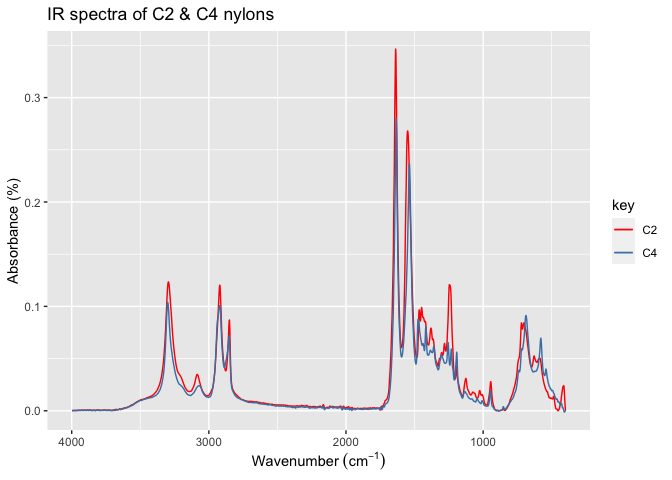
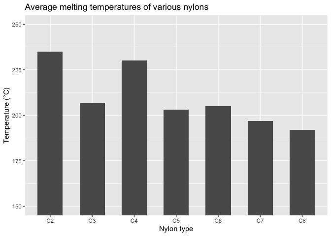

Properties of Nylons
================

## Introduction

The following IR and melting point data was collected by my CHM 312
(Polymer Chemistry) class as part of an experiment involving nylon.
Nylon is a polymer, and its repeat unit is an amide group followed by a
certain number of carbon atoms. Nylon types are named according to the
number of carbons in their repeat units. For example, C6 nylon has six
carbons per repeat unit, while C4 nylon only has four. Thus, in C4 the
amide groups are closer together. This difference can have noticeable
affects on the behavior of the two polymers.

## Nylon length and functional groups

Infrared spectroscopy (IR) detects the functional groups in a polymer.
Here we use IR data to compare the functional groups in two types of
nylons, C2 and C4. Note that while there are some minor differences, the
IR spectra of C2 and C4 are largely identical. This is expected, since,
despite their differing lengths, the two nylons contain the same types
of functional groups (amides and hydrocarbons).

<!-- -->

## Nylon length and melting point

Here we examine the correlation between repeat unit length and the
melting temperature of the polymer. Note that as the number of carbons
increases (and thus the percentage of amide decreases), the melting
temperature of the polymer decreases. This is logical since melting
temperature is largely determined by the strength of the intermolecular
forces, and the amide groups produce the stronger intermolecular forces.

However, an interesting trend to note is that, especially for shorter
repeat units, even numbers of carbons produce *much* higher melting
temperatures than odd numbers. This phenomenon is well documented but
not well understood. One possible explanation is that an even number of
carbons spaces the amide groups optimally to create the strongest
intermolecular forces.

<!-- -->
